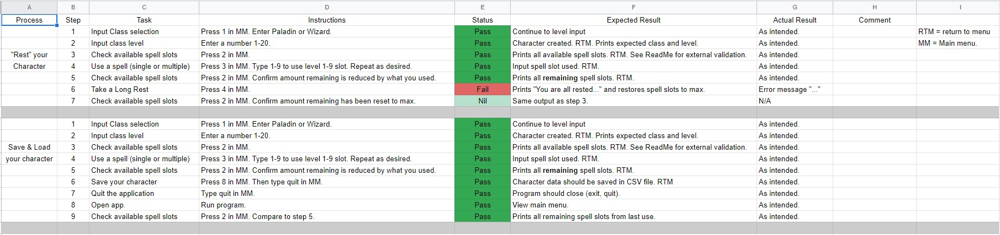
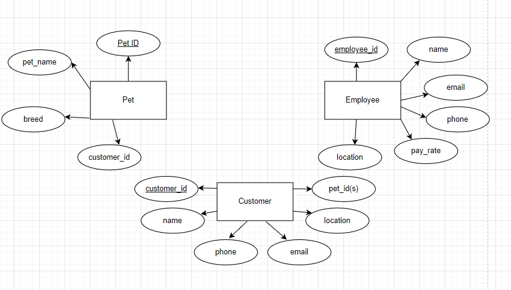
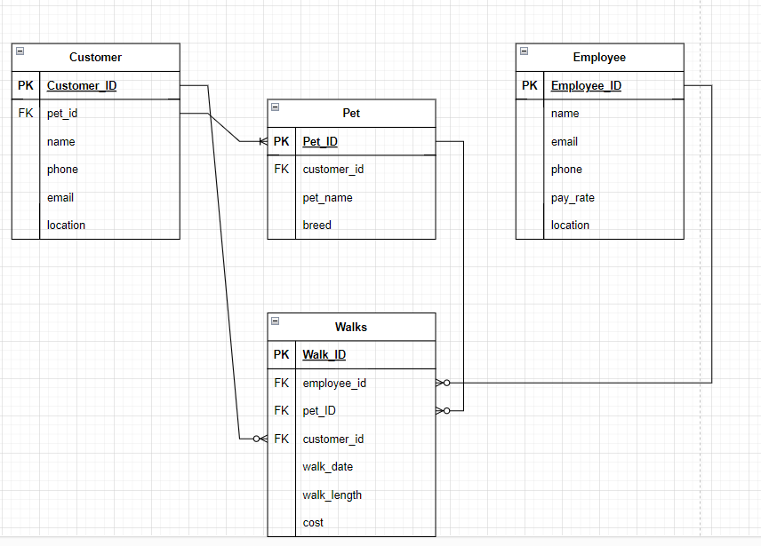

## Q1: Describe the architecture of a typical Flask application

Flask is a web application framework that gives developers the ability to assign their application to a flask object and allows you to associate your routes to view functions. <sup>(1)</sup>

The start of a Flask framework will see you importing flask from Flask (using pip install flask on a terminal or virtual environment), then importing flask from flask in your app.py file [This is what Flask will recognize as your application]. 

Next you'll assign your application by creating a flask object (example below), then you're able to create the association between the function and route by using the app.route decorator. A very simple example for the index page would look like below:


```python
from flask import Flask

app = Flask(__name__)

@app.route('/')
def index():
    return "This is the index of your app"

```

The function can then be viewed (by default) on your web browser at http://localhost:5000, then including the route specified (e.g. /login).

At the end of your flask application the following code will let you run flask by running the ```python app.py``` command. You can expand on this by turning debugging = True to allow you work with changes in code in real time without restarting the server.


```python
if __name__ == "__main__":
    app.debug = True
    app.run()
```

Flask also allows for Dynamic routes, which shown below allows for input such as strings, integers and floats that will return different information depending on the value. For example if it were an integer based on age, you would be able to allow access to only people who were of a certain age based off dynamic routing like below. 

```py
@app.route('/site/<int:Age>')
def allow(Age):
    if Age < 18:
        return f'You have been allowed to enter because you are over {str(Age)} years old.'
    else:
       return f'You are not allowed to enter'
```

----

## Q2: Identify a database management system (DBMS) commonly used in web applications (including Flask) and discuss the pros and cons of this database

SQL is a language for storing and using information in a relational database using rows & columns to represent data & their relationships. SQL gives you the ability to store, update, remove, search & retrieve data from its database. 

PostgreSQL (also called postgres) extends the standard SQL programming language to provide better architecture, reliability, data integrity, robust features & extensibility. <sup>(2)</sup>
This provides great customization for making databases to cater to the exact needs of the developer/users. PostgreSQL can be accessed via python by using a connector library such as Psycopg2, allowing python scripts to perform UPDATES, INSERTS, DELETE etc. When combined with flask this gives the ability for users to perform these actions from the website. 

PostgreSQL is very well regarded due to its long-standing history of being a powerful & open-source with >35 years of development, is almost completely SQL compliant (with exceptions being intentional for better architectural decisions), processes complex datatypes (and highly expandable), has great language support (for example, python with flask -- supports JSON) and is cross-platform. The disadvantages are that most supporting documentation is available only in English and it has a low reading speed compared to other database management systems. 

These disadvantages do not keep it from being one of the most popular DBMS's availability as the power & flexibility of PostgreSQL is incredibly useful to developers. 

----
## Q3: Discuss the implementation of Agile project management methodology

An Agile workflow describes an approach to software development that allows for quick (read: agile) responses to changes in project scope, objective and requirements. Instead of having distinct sequential projects and phases Agile prefers work cycles that include customers, testers and evaluation/feedback at every phase.

Another benefit agile workflow gives is allowing the entire team to contribute all the way throughout the cycle instead of distinct from eachother giving flexibility, insight and understanding to the entire team, while also preventing "blockages" along the way causing the project to be held up in one 'stage' before proceeding to the next. Each person is able to do their work simultaneously. 

To implement an agile workflow you can follow the 6 steps no matter which methodology you wish to follow. Keep in mind the wording can change from user to user, but the ideas are similar.  

### **1. Ideation:**

The team should conceptualize the project, determine the product features needing to be developed and realize the minimum viable product. Tools such as user stories can be of assistance in this stage. This should output a business scope and product backlog.

### **2. Planning:**

Here sprint teams should be created & assigned tasks, with goals, timeframes and resources allocated. User stories can also be completed in this stage. 

### **3. Iteration:**

Sprint teams work on their first iteration of the project and product backlog is addressed. If it's not the first iteration, then customer / stakeholder feedback is taken into account in another sprint. 

### **4. Release:**

The current iteration is released to the customer, customer feedback can be obtained and the cycle is repeated until the final iteration is delivered meeting all stakeholder & customer requirements/expectations. 

### **5. Production:**

After all testing & documentation is complete, the product is now in the production phase. The Agile team oversees the successful launch and provides support where needed for its release. 


### **6. Retirement:**

The completion of the agile process is a successful product given to the customer. The Agile team then moves on to the next project/project development cycle. 


Within the umbrella Agile framework there are multiple approaches in methodology. The most common are: Scrum, Kanban, Extreme Programming (XP), Lean Development and Crystal. Scrum and Kanban used widely, and feature different approaches to the same framework, where scrum is usually more structures with regular sprints and a focus on learning loops to gain feedback and knowledge. Kanabn focuses on visualization of the work, usually through a Kanban board that focus on breakdowns of the project (usually in user stories) and focus on continuous improvement.

----

## Q4: Provide an overview and description of a standard source control workflow

Git has multiple workflow templates available for everyone to use or take inspiration from when creating their source control workflow; for example "Centralized workflow". It uses a central repository with a "main" branch where all changes are committed to.

To use a centralized workflow developers clone the repositories, then edit and commit locally. These changes remain independent from the origin until the developer is ready to "push" the commits to the main branch. This is fine on it's own if only one person is working on the code at a time, however that usually isn't the case, which is where managing conflicts becomes important.

If your local commits do not match the central repository (i.e. there has been another commit since you cloned the repository) then Git will refuse to push your changes which will overwrite the central commits. You can however fetch these commits and add your changes along with the other changes merging your changes onto the online stream. This can be done with ```git pull --rebase origin main```.

Git will transfer the local commits individually allowing you to resolve conflicts at every stage and create a 'cleaner' and easier history to navigate. If possible, it's best to have people working on seperate sections of code as this will prevent rebasing from generating conflicts. If there is, the individual needs to resolve the conflicts to finalize the push. 

This control workflow is great for teams of few members as each conflict will take time to resolve, and will esculate with the number of people working on it. There are other workflows designed for teams of larger numbers that reduce the work required, however are usually more complex.<sup>3<sup>
 
----

## Q5: Provide an overview and description of a standard software testing process (e.g. manual testing)

----

Manual testing is as the name implies, done manually by a person rather than automatically running coded tests. This can be done by a dev or tester to verify features are working as intended in both a closed environment, and working between features that need to communicate. 

A process can be laid out with a description of every step the user needs to take, the status of that function and expected vs actual result. The below is a manual test I made in a terminal application that took one lot of data, and ran it through various other functions to manipulate it.

This was more effective than automatic tests to implement as my main concern was data integrity between functions and that none of the functions caused errors between uses, so by manually testing each of these functions and verifying it was working as intended manual testing is able to verify the functions are working as intended and potentialy identify what functions would not be working or passing the data correctly if new functions were added. 

This same reasoning can be applied to many projects where data needs to be manipulated in various forms depending on the current need. As each function is designed, its interaction with other functions can be monitored in ways that are more complicated to write automatic tests for. 



## Q6: Discuss and analyse requirements related to information system security and how they relate to the project

----

ACME's database and website will will likely have sensitive information that should only be distributed to selected users, making this project in need of data protection & user authentication and assigning permission. 
In a Flask application, JWT is a simple and effective security module to provide API authentication. 

JWT authentication works by taking the user entered username and password and comparing it to the User table for a match. Once a match is found, it generates and returns a JSON web Token (A long alphanumeric token) and gives the front end a 200 success status, which the front-end will use for future requests. In future requests include an authorization header, and the API validates that token for further requests (if that token is valid). Once JWT is set up on the Flask server, getting authorization for any function is as simple as using the @jwt_required() decorator. 

JWT Tokens are bigger than both Basic tokens, which are the shortest and therefore easier to hack (less combinations), and Bearer Tokens. Another benefit over bearer tokens is they also don't need to be stored in a database, and therefore reduce the memory and steps required -- all the information needed from the token are found in the token instead, which is separated into its header containing the encryption algorithm, the payload which identifies the user and the signature which is generated by the other sections. 

----

Flask-security (installed with ```pip install flask-security-too```) which installs a number of dependencies focused on security mechanisms for a Flask app. 


Flask-Login provides session-management for logging in & out and "remember me" functions for user sessions in whatever form you want -- however it is restricted to only usernames & passwords. It does this with an "alternative token" based off a randomly generated id linked to the users primary id, making the old session invalid when a new id is generated. 

It also provides Access-control by assigning permissions to specific roles (e.g. administrator, editor), which can then be assigned to users. These permissions are made into strings giving complete control to the developer to how they're assigned.     

Passwords from users must meet secure requirements that can be defined by the developers, checking parameters such as password-length, if the password has been in a security breach (or an amount of breaches it is allowed to have been in), assess the complexity of the password, how long it would take to 'crack', and provide feedback to improve to improve it. The password is then protected with hashing algorithms which can be decided by the developer, or defaulted to bcrypt. 

Authentication toakens are generated via username & password and can be used to authenticate throughout the website, and can be customized with extra layers of protection depending on the devs needs -- for example by making them csrf tokens, or by changing when they expire, or the conditions that trigger the expiration. Flask-security provides many other common problem-solving methods; Two-factor authentication, email confirmation & password recovery.

----

Overall, Flask-security provides many customizable options for the developers to create a secure Flask application the way that they want, however some of the packages are no longer kept up to date and for pure authentication JWT is much easier to set up, but has less customization. 

----

## Q7: Discuss common methods of protecting information and data and how you would apply them to the project

I am familiar with using JWT-extended as mentioned above to provide authentication and protect information. By setting up the secret key, the endpoint (POST) for creating tokens you can use the jwt_required() decorator to prevent access to unauthorized users.  

Other practices I am familiar with are implementing CSRF protection from flask_wtf. This along with other best-practices (properly using GET requests for retrieving data, POST for changing information) and mandating CSRF tokens will protect the site from a CSRF attack. 

Flask-security also provides a lot of options to use (like flask_wtf above) that I have read about and would appreciate learning to use these in practice to add security to this project. 


----

## Q8: Research what your legal obligations are in relation to handling user data and how they can be met for the project

In Australia we are required to uphold the requirements in the Privacy Act 1988 in regards to collection, use, storage & disclosure of personal information if you fit into a broad range of criteria (an extensive checklist can be found [here](https://www.oaic.gov.au/privacy/privacy-for-organisations/small-business#PrivacyChecklistForSmallBusiness). 

Assuming we fit one of the criteria for these, we are required to follow the thirteen privacy principles:


1. Be open and transparent with management of personal information.
    * By providing a clear privacy policy, we can be transparent to users and staff about how we intend and enact the management of personal information. 
    * Some websites have their privacy policy available for viewing if the user would look for it, however my opinion of the best practice for this APP is a pop-up before providing personal information for our privacy policy which gives the user a sense of security by showing we are putting the effort in to be transparent about how we would handle their data. 

2. Provide anonymity & pseudonymity.
    * If it is practical / applicable, we should provide users the ability to work with anonymity or pseudonyms with us. 
    * One option is giving users the ability to be referred to by their email, but most of the time people have personal information such as their name and birth year in their email. In my opinion, a better alternative is giving users the ability to use a username instead of their First name or other identifying data meets this principle by giving them a pseudonym and keeping the least amount of data possible, or if we are keeping the information still limiting how much is shared with other users at an individuals discretion.  

3. How we can collect solicited personal information:
    * We should only solicit personal information that is neccessary for the function of our application or business.
    * Only solicit sensitive information if the individual consents (with few exceptions which should be verified).
    * With a clear business model and functions clearly understood, we can decide what information we absolutely need, what information would be useful but not neccessary and information that isn't neccessary and then give the users the ability to only provide as much information as neccessary, and provide the optional ability for more information to be submitted at the individuals discretion.

4. How to deal with collected (unsolicited) personal information:
    * If we are recieving unsolicited personal information that we could not have solicited, and is not contained in a commonwealth record we must destroy or de-identify this information as soon as possible.
    * Any unsolicited information kept because it could have been collected under APP 3 or contained in a commonwealth record must be dealt with in accordance to the other APP's. 
    * Writing clear guidelines about what information could be solicited similar to APP 3 above would give an understanding of what information could be solicited and therefore outline what information fits under this category in a clear and precise manner, making this APP much easier to follow routinely instead of treating these all as a case-by-case situation. This option saves more time and acts in an ethically consistent manner. 

5. Notification of collection of personal information. 
    * We must take reasonable steps to notify indivudals when we collect their information, our identity, the circumstances of collection and whether or not its authorized by law, its purpose & consequence if not collected and our disclosures such as privacy policy. 
    * A blanket statement could be prepared to cover the gathering and usage of all information in a generic way to cover all bases which be a cheap and fast method to cover this APP, however my recommendation would be for the company to take a few seperate approaches to this: 
    * By having prepared letters/emails when collecting from the user, having trained staff able to respond to any query's the user may have and having prepared notices to send if the collection is unsolicited are all showing integrity to deal with data and transparency in how we are prepared to handle it. Taking more measures here would show that we are prepared and capable to the user and increase confidency, and cover more bases for this APP.

6. Use or disclosure of personal information:
    * We may only use or disclose personal information for the purpose of which it was collected (with a few exceptions). 
    * Relating back to APP 3 again, having a clear function for why we are collecting data would ensure we get the data that we need for our function and limit our use & disclosure of other data because it would be outside the scope. 
    * The alternative to having the clear plan is having individual plans for each usage of personal data however these might not all fit under the primary purpose of collection and would need to be reviewed on a case-by-case basis which would take more time & resources and not be as effective, ethical or transparent. 

7. Disclosing personal information for direct marketing. 
    * We can only use personal information for direct marketing if the information is collected directly from the user and it is reasonable to expect their information to be used for direct marketing. 
    * We also must allow the user to "opt-out" of this direct marketing and comply with that request. This could be done via email from the user to customer services, but automating it in a link with all marketing would be less constant work for staff and give the user more direct control over the usage of their personal information and therefore increase confidence in their data being managed by this company.

8. Overseas disclosure of personal information. 
    * We must (reasonably) ensure any information we disclose overseas recipient will not breach the APPs, and holds us accountable for their handling of the data.
    * Whenever we disclose information to an external source we should 1) verify that it holds a purpose to the function of the business or to meet another requirement, and 2) vet the companies privacy policy to check they will appropriately handle the data we disclose. 

9. Adoption or use of government related identifiers. 
    * The company may not adopt use or disclose government identifiers unless a specific exception applies. 
    * If an exception applies, this is considered personal information and must be dealt with extreme caution and intention. 

10. Quality of personal information
    * The company should take reasonable steps to maintain accurate, up to date and complete personal information (if it is to do with the function of the business). 
    * The company could do this with routine emails reminding the user to update information where applicable. Another way to get this question in is regular checks at appropriate time-gaps when the user accesses a service, prompting them with "are these details correct", that way it isn't "out of the way" for the user by prompting when they are intending on accessing the service anyway.
        * A good example of this is when going to the doctors, they will usually ask to verify your perosnal information is up to date. Since you're already there, you're more likely to update it than if you were prompted with an email at a potentially inconvenient time. 

11. Security of personal information
    * We must take reasonable steps to protect personal information from misuse, interference & loss, unauthorized access, modification and disclosure.
    * This can be assisted with Flask-Security, JWT-tokens and a range of other methods to protect unauthorized access to data, or unauthorized modification of existing data (with the same information from Q6 & 7).  

12. Access to personal information
    * If we hold personal information about an individual, we must be able to give access to that information on request.
    * This could be arranged on a website with a role for users to be able to access their own information which exludes them from accessing others information to suit APP 11 & 12, and giving them the ability to modify this information for APP 10. 

13. Correction of personal information
    * We must take reasonable steps to correct personal information to ensure that the data is accurate, complete, relevant and not misleading.
    * This can be met by providing users with the ability to update the information themselves, as we are required to at their request. Any updates made should be provided if that information was sent to another APP entity automatically to reduce workload and comply with APP 13. 
    * If suitable, have dedicated staff available to assist users who may have their requestsrefused as a reason for refusal must be provided, and the staff could facilitate the collection of correct information in a timely manner. 


----

## Q9: Describe the structural aspects of the relational database model. Your description should include information about the structure in which data is stored and how relations are represented in that structure.

 Databases before relational database models in the past were hard to use, maintain and edit, required a lot of developer knowledge and suffered poor performance creating the need for a better database system, which is where relationship database models (such as SQL) came in. Relational database models strengths lay in its use of tables in an intuitive efficient and flexible manner to store, access and edit structured information.<sup>(7)</sup>

 These tables can be used to represent relations in numerous forms that is easiest to express with an example, and I will use a dog walking business as an example. 

In the dog walking business we have a few entities (objects) that we want to store information for. For us, this could be the employee, the customers and the pets. Each entity then has attributes which is all the stored information about the entity. One of these attributes needs to be a primary key, unique to each individual case of the entity. This is usually a serial id number.

For our employee, the attributes could be: employee_id, name, email, phone, pay_rate, location. 
For the pets: pet_id, pet_name, owner_id, employee_id, breed.
Finally the customers: customer_id, name, phone, email, location, pet_id.

This is what the entity-relationship diagram looks like below. 
 

To further describe the relationships between each of these attributes, we can determine for example that each customer may have multiple pets to take for walks, so customer to pet_id is a one-to-many relationship. 

Other relationships that could hypothetically happen are many-to-many, you could assign a relationship for many employees to be walking many pets within their employment. Another way of handling this is making a seperate table for each instance, also with a unique id. In this business, we will track "walks" like an invoice, it tracks the foreign keys employee_id, pet_id, customer_id, walk_date, walk_length & cost. 

This way instead of creating multiple many-to-many relationships, we have simplified this to one-to-many relationships per walk, and kept track of all the walks that have happened instead. The relationship shown between pet_id foreign key in customers and pet_id primary key is one-to-one-or-many. Here it means each customer must have a pet, but they could also have many (more than one) pets.



SQL allows the linkage between these tables using these foreign keys which can then be used to retrieve information in joined tables, for example, if you wanted to send an email about all the pets that were talked on a day, you could find all the customer_id's that correlated to walks on walk_date, and join the email section to get a list. 


----

## Q10: Describe the integrity aspects of the relational database model. Your description should include information about the types of data integrity and how they can be enforced in a relational database.

Integrity is the concept of enforcing a set of rules on a database to ensure the data is consistent & accurate. This plays an important role in keeping databases robust, efficient and able to perform tasks to meet the demand of the developers/stakeholders.

Integrity constraints are used to ensure data follows the intended rules when entered to prevent errors/inconsistencies, or even just to follow the rules of the business. For example, a bank would disallow a customer from withdrawing more funds than what they have in their account, even if a database can process a negative number. 

These constraints are easy for users and devs to use and descriptive when mistakes have been made which makes it easy to mend input mistakes and on the spot as the checks are done automatically. The rules are easy to implement from a developer point of view, and can be repeated across the entire database.


These are the four main types of integrity constraints:

----

### Domain constraints:

A domain constraint restricts the values that can be entered to a valid number. In the bank example, having a limit between 0 and 10 billion would only allow an account to have funds between that range, and less and it would prevent withdrawing, and anymore would prevent depositing. Only valid data is able to be entered into the database. 

You can also specify whether or not you're able to hold a null value. For example, a banking customer must provide their name, date of birth and address for identity security. Using ```NOT NULL``` would force you to enter these details before you're able to set up an account. 

You may also specify whether the value has to be unique (the customers id number, for example), data type (a valid date of birth in case of a mistype), and a default value (having the default option for "signed up for promos" as NO.) 

----

### Entity Integrity Constraint:

Each record (row) in a table must be unique in some manner, which is usually ensured with a unique primary key. In most cases this will be a serial ID number (e.g. client ID number for a bank). If the primary key is not unique, the database should throw an error. This ensures retrieval of information in the database is accurate and not ambiguous.

----

### Referential Integrity Constraint & Key constraints

The relationship between one table and another is linked via a foreign key to (usually) a primary key of another table. This constraint checks to make sure there is a valid value in the corropsonding column of the other table. Unique keys are another constraint that means the value must be unique. In the bank example, a bank account would need to be unique, even if it is attached to a person with a unique id, sending money to other accounts needs to be precise (although this example may be faulty as bank accounts would likely have their own table, the idea persists).  

----

## Q11: Describe the manipulative aspects of the relational database model. Your description should include information about the ways in which data is manipulated (added, removed, changed, and retrieved) in a relational database.

Data in a relational database model can be manipulated with Data Manipulation Language (DML), with the main ideas being create, read, update and delete (a.k.a CRUD), however, wording can change between DBMS's, (e.g. insert, select, update and delete). Most of the names implies already what they can do, however the specifics are:

Create/Insert:
* Allows you to create new data; a new table or record.

Select/Read:
* Returns records or items based off your search criteria, which may result in multiple records.
* Commands such as: 
    * SELECT column1, column2, column3
    * FROM table_name
* Will show the first 3 columns of table_name.
    * Select *
    * FROM table_name
* Will show all records from table_name. You can also use the WHERE clause to find specific data you are looking for. E.g. if I wanted to find "John"'s employee ID number at my bank, I could search for this by specifying what columns I am looking for, what table I'm looking from, and what parameter I am searching by:
    * SELECT EMPLOYEE_ID, NAME
    * FROM EMPLOYEES
    * WHERE NAME = 'John'

Update:
* Modify existing records based on similar search terms to read/select -- you can be specific about the records to update by using terms in search such as the WHERE clause. 

Delete:
* Remove records from the database. This can be modified between a 'hard' delete to remove the record permanently, or a 'soft' delete which flags the record but doesn't remove it for maintaining documentation. 

Alter:
* Used to add, delete or update the attributes of tables in the database. 

----

This can be done in the terminal directly using the DBMS language, or, you can do this through Flask & Python which will translate to the DBMS language for you. For example, every time a user registers to your website the user will fill out a form completing all the information needed to go into the database, and will be inserted as a new record. For example, through SQLAlchemy, through an instance of SQLAlchemy (e.g. db) you can retrieve the JSON information and db.session.add(user) to add a record of the user to your database. 

These commands take setup through modules beforehand, but give users the ability to modify tables (with permission if required), insert and potentially delete or update existing records should they be given the means. 

----


## Q12: Conduct research into a web application (app) and answer the following parts:

My chosen web application is spotify -- a music, podcast & video streaming service. 

----

 ### a. List and describe the software used by the app.

Spotify uses [Python](https://engineering.atspotify.com/2013/03/how-we-use-python-at-spotify/) to program their backend services & data analysis which are connected by ZeroMQ. While the majority of the backend is written in Python, Java, C or C++ are also used. For Data analysis, Python interacts with Hadoop using Luigi packages to build batch jobs and bring errors logs to a local machine, allowing the dev to build and debug complex jobs quickly. 

With the majority of Spotify written in python, you'll be able to see how this fits into their various functions for users; signing up or loggin in when you first enter the website, creating a library, searching for individual songs or updating your own information. Python is [confirmed to be used](https://engineering.atspotify.com/2013/02/in-praise-of-boring-technology/#:~:text=Historically%2C%20Spotify%20has%20been%20a,persistent%20storage%20%E2%80%93%20when%20it%20works.) for DNS resolvers for clients, and for using the psycopg2 library in python to interact with PostgreSQL using python scripts. An example of this could be a user updating their contact information, the commands written in python would then be translated for SQL to update the database.

Spotify features and services use [Cassandra and PostgreSQL](https://engineering.atspotify.com/2013/03/backend-infrastructure-at-spotify/#:~:text=The%20Spotify%20infrastructure%20offers%20a,%3A%20Cassandra%2C%20PostgreSQL%20and%20memcached.) to replicate their data between sites. Cassandra (or Apache Cassandra), along with other "no proprietary" software is great to use as it can be modified to the specific uses Spotify needs it for. In the transition from PostgreSQL, [Spotify has found for its purposes](https://engineering.atspotify.com/2013/02/in-praise-of-boring-technology/#:~:text=Historically%2C%20Spotify%20has%20been%20a,persistent%20storage%20%E2%80%93%20when%20it%20works.) Cassandra has better replication, behaves better during networking issues and in certain failure cases. 

When a user tries to acces a HTTP service, they are directed to an NGINX server for load balancing and [split requests in different ways](https://engineering.atspotify.com/2015/10/designing-the-spotify-perimeter/#:~:text=First%2C%20nginx%20supports%20geolocation%20via,nginx%20supports%20file%2Dbased%20logging.). For example, generic requests for standard websites are sent to only two servers in Eurpose and West Coast, US. API endpoints and requests from the application/clients are handled in every datacenter due to the greater need for logic, and need for fast response.  

[Hadoop, Kafka and Elastic](https://engineering.atspotify.com/2015/10/designing-the-spotify-perimeter/#:~:text=First%2C%20nginx%20supports%20geolocation%20via,nginx%20supports%20file%2Dbased%20logging.) search are all used to create clusters -- groups of servers which are used to track logs from Load balancers and audit trails from Squid. This provides visualization of incoming HTTP requests across the 'perimeter', which support Health check features and automatic removal/rotation of servers from NGINX along with storing valuble data. 

[Apache storm](https://engineering.atspotify.com/2015/01/how-spotify-scales-apache-storm/) is used for functions like ad targeting, music recommendations & data visualizations using Kafka and Cassandra as its sources. It uses very little resources, and can be made with easy-to-read and use code, making its scalability a massively desired quality. 

Each website is made using puppet as it has simple syntax and can be created with two lines, which are then tested and reviewed. The websites are then usually built with CSS, HTML, Javascript and in Spotifies case uses Boostrap to provide tools and reduce maintaince for web development languages. It greatly assists in responsive design helping the web application to be available for phones, tablets and desktops. 

----
 ### b. Describe the hardware used to host the app.

Spotify originally managed its data centers through Amazon Web Services (AWS) as it offered dynamic storage options, storage lifecycle management and utilization advice as Spotify would keep gaining access to more licensed songs. Previously it hosted all it's infrastructure on AWS as well, however in recent years it has been moving to Google Cloud servers for this as it leads in efficiency and effectivenes. Google also has options for leasing ["datacentre space, server hardware & networking gear as close to customers as possible"](https://www.zdnet.com/article/spotify-to-switch-from-aws-to-google-cloud/).


Spotify uses a combination of Amazon Web Services (Cloudfront, S3) and Google Cloud


----
 ### c. Describe the interaction of technologies within the app


----
 ### d. Describe the way data is structured within the app


----
 ### e. Identify entities which must be tracked by the app


----
 ### f. Identify the relationships and associations between the entities you have identified in part (e)


----
 ### g. Design a schema using an Entity Relationship Diagram (ERD) appropriate for the database of this website (assuming a relational database model)


----

# References

(1) https://realpython.com/python-web-applications-with-flask-part-i/#what-we-are-building <br>
(2) https://www.postgresql.org/about/ <br>
(3) https://www.atlassian.com/git/tutorials/comparing-workflows <br>
(4) https://flask-security-too.readthedocs.io/en/stable/ <br>
(5) https://jwt.io/introduction <br>
(6) https://www.oaic.gov.au/privacy/australian-privacy-principles/australian-privacy-principles-quick-reference <br>
(7) https://www.oracle.com/au/database/what-is-a-relational-database/#:~:text=The%20relational%20model%20means%20that,data%20as%20a%20logical%20structure.
(8) https://www.knowledgehut.com/blog/database/integrity-constraints-in-dbms